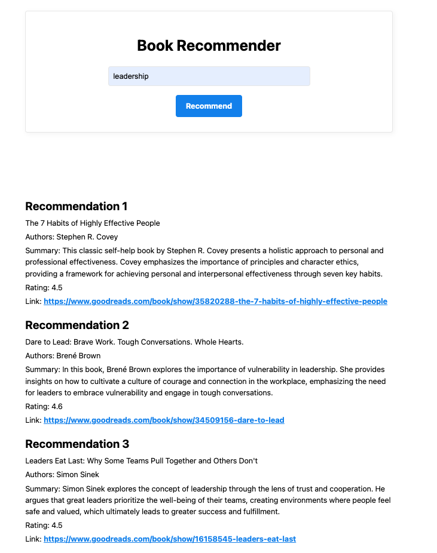

# Book Recommender



## **Introduction**

**Book Recommender** is a personalized book search and recommendation application designed to transform the way users discover their next great read. Built as a **Flask web application**, it provides an accessible and user-friendly interface for finding books tailored to individual interests. By leveraging the **Google Books API** and **LangChain’s LLM-driven agent framework**, the app combines advanced AI capabilities with reliable book data to ensure that recommendations are not only relevant but also popular and highly rated.

## **Core Functionality**

The application offers a powerful search engine that integrates with the **Google Books API** to retrieve comprehensive results for any query. Users can quickly access a diverse selection of books that match their search terms. To enhance the browsing experience, Book Recommender utilizes an **LLM** to condense lengthy book descriptions into concise summaries, allowing users to quickly assess whether a book aligns with their preferences.

At the heart of the app is its recommendation engine. Using **LangChain**, the app evaluates the books retrieved from searches and generates three curated recommendations for each query. These recommendations are based on relevance to the query and the popularity of the books. Each suggestion includes detailed information, such as the title, a brief summary, the list of authors, the average rating, and a link to explore or purchase the book. The **Flask framework** serves as the backbone of the app, providing a lightweight, scalable platform to deliver these results through an intuitive web interface.

## **Reliability and Validation**

To guarantee accuracy and reliability, Book Recommender employs **Pydantic** to validate the structure and content of the recommendations. This ensures that the output adheres to a predefined schema and maintains a consistent format, even when dealing with complex or varied input data. Robust error-handling mechanisms are also in place to make the system resilient to unexpected issues during the recommendation generation process.

## **Technology Stack**

The application is built using **Python** and integrates the **Flask** framework for its web-based functionality. It relies on **LangChain** to power its LLM capabilities and the **Google Books API** as the primary source for book data. Additionally, **OpenAI’s GPT model** is used for text summarization and recommendation logic. **Pydantic** ensures structured and validated outputs, while the overall architecture is designed to be scalable and efficient, making the app suitable for deployment on personal or small-scale setups.

## **Future Enhancements**

The current version of Book Recommender is focused on delivering an intuitive and intelligent user experience, but there is significant potential for future growth. Planned improvements include user profiles for personalized recommendations, advanced filters for criteria like price, language, and publication date, and expanding the app to mobile platforms. Social features, such as the ability to share recommendations or read community reviews, could also further enrich the user experience.

## Usage

Clone this repo (https://github.com/JoKerDii/book-recommender):

```bash
git clone https://github.com/JoKerDii/book-recommender.git
cd book-recommender
```

Create a virtual environment:
```
python -m venv llm_venv
```

Activate the virtual environment:
```bash
source llm_venv/bin/activate
```

Download required dependencies:
```
pip install -r requirements.txt
```

Create `.env` file and add OpenAI API Key:

```bash
echo "OPENAI_API_KEY=sk-*******" | cat > .env
```

Run the application locally:

```bash
python3 app.py
```
